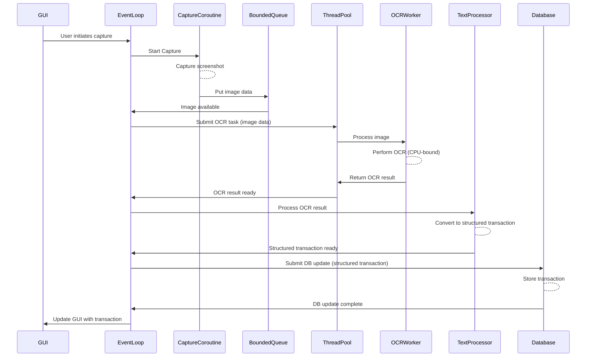

# Phase 2 Day 1: Async OCR Queue Architecture

## Objective
The primary objective for Phase 2 Day 1 is to redesign the OCR pipeline to improve performance by enabling overlapping capture and OCR tasks. This aims to reduce the overall processing time and enhance responsiveness.

## Current Synchronous Pipeline Constraints
The existing OCR pipeline, primarily found in `tracker.py`, operates synchronously and presents several limitations:
- **Blocking Execution**: The main thread is blocked during capture and OCR operations, leading to an unresponsive GUI.
- **No Asyncio**: The current architecture does not leverage `asyncio`, preventing concurrent execution of I/O-bound and CPU-bound tasks.
- **Shared Mutable State**: There is shared mutable state, particularly around database access and configuration, which can become problematic in a concurrent environment.
- **CPU-bound Tasks on Main Thread**: OCR is a CPU-bound task that currently runs on the main thread, exacerbating blocking issues.
- **Synchronous GUI Interaction**: GUI updates and interactions are tightly coupled with the synchronous processing, leading to freezes.
- **OCR Caching**: While an OCR caching mechanism exists (`utils.py`), its synchronous nature and interaction with shared state need careful consideration in an async redesign.
- **SQLite Threading**: `database.py` uses SQLite, which has specific threading requirements that must be respected when integrating with `asyncio` and thread pools.

## Target Asynchronous Architecture Redesign Scope
The proposed asynchronous architecture will leverage `asyncio` and a shared `ThreadPool` to manage concurrent operations:
- **Asyncio Event Loop**: A central `asyncio` event loop will orchestrate the asynchronous operations.
- **Bounded Queue**: A bounded queue will act as a buffer between capture tasks and OCR worker coroutines, regulating the flow of images/data.
- **Capture Coroutines**: Dedicated coroutines will handle screen capture, which is primarily an I/O-bound operation.
- **OCR Worker Coroutines/ThreadPool**: OCR, being CPU-bound, will be offloaded to a shared `ThreadPoolExecutor` to run in separate threads, preventing the main event loop from blocking. Worker coroutines will interact with this thread pool.
- **Database Updates**: `database.py` interactions will be adapted to be asynchronous, likely by running SQLite operations in the `ThreadPoolExecutor` to avoid blocking the event loop and adhering to SQLite's threading model.

## Proposed Event Loop Structure

This section details the core components and their interactions within the `asyncio` event loop.

### 1. `asyncio.Queue` Configuration
A bounded `asyncio.Queue` will serve as the primary communication channel between the capture coroutines and the OCR processing workers.
- **Purpose**: To decouple image capture from OCR processing and to prevent memory overload by buffering a limited number of raw screenshots or pre-processed image data.
- **Bounded Capacity**: The queue will be initialized with a `maxsize` to exert backpressure on the capture process if OCR workers fall behind, preventing excessive memory consumption.
- **Data Type**: The queue will primarily hold image data (e.g., NumPy arrays or PIL Image objects) and associated metadata (e.g., timestamp, source).
- **Example**:

```python
from asyncio import Queue
MAX_QUEUE_SIZE = 10  # Configurable queue size
ocr_queue = Queue(maxsize=MAX_QUEUE_SIZE)
```

### 2. Shared ThreadPoolExecutor Usage
CPU-bound tasks, primarily OCR and potentially certain parsing or database operations, will be offloaded to a ThreadPoolExecutor to prevent blocking the asyncio event loop.

- **Initialization**: A single ThreadPoolExecutor instance will be created and shared across the application. Its size will be configured based on available CPU cores to optimize performance without excessive context switching.
- **Offloading CPU-bound Tasks**: Coroutines will use `loop.run_in_executor(executor, func, *args)` to submit CPU-bound functions to the thread pool. This allows the event loop to continue processing other awaitables while the OCR task runs in a separate thread.
- **Thread-Local Data**: If any resources (e.g., OCR engine instances, database connections) are not thread-safe or are expensive to create, they may be managed using thread-local storage within the ThreadPoolExecutor workers. This is especially relevant for SQLite connections, which require distinct connections per thread.
- **Example**:

```python
from concurrent.futures import ThreadPoolExecutor
import asyncio

# Initialize the executor
executor = ThreadPoolExecutor(max_workers=4)  # Adjust based on CPU cores

# Get the running event loop
loop = asyncio.get_running_loop()

# Example of offloading a CPU-bound function
async def perform_ocr(image_data):
    def ocr_func(data):
        # Simulate CPU-bound OCR processing
        return "extracted_text"
    
    result = await loop.run_in_executor(executor, ocr_func, image_data)
    return result
```

### 3. Task Management
Tasks will be managed through the asyncio event loop to ensure efficient scheduling and concurrency:
- **Coroutine Creation**: Use `asyncio.create_task()` to schedule capture and worker coroutines.
- **Worker Pool**: Multiple OCR worker coroutines will consume from the bounded queue, each offloading OCR to the thread pool.
- **Backpressure Handling**: If the queue is full, capture coroutines will await until space is available, preventing overload.
- **Cancellation Support**: Tasks will support cancellation via `task.cancel()` to handle user interruptions or shutdowns gracefully.

### 4. Graceful Shutdown
To ensure no data loss or resource leaks during shutdown:
- **Shutdown Hook**: Register a shutdown coroutine that awaits all pending tasks using `asyncio.gather(*tasks, return_exceptions=True)`.
- **Queue Draining**: Consume all remaining items in the queue before shutting down workers.
- **Executor Shutdown**: Call `executor.shutdown(wait=True)` to wait for all thread pool tasks to complete.
- **Resource Cleanup**: Close database connections and release any held resources in a finalizer coroutine.

## Feature Flag Implementation
To enable safe testing of the new asynchronous pipeline without risking the existing synchronous functionality, a feature flag named `USE_ASYNC_PIPELINE` will be introduced. This flag allows toggling between the synchronous and asynchronous implementations at runtime, facilitating A/B testing, gradual rollout, and easy rollback if issues arise.

### Configuration
- The flag will be defined in `config.py` as a boolean value, defaulting to `False` to preserve the current behavior.
- It can be set via environment variables, a configuration file, or command-line arguments for flexibility in different environments (e.g., development, testing, production).

**Example in `config.py`**:
```python
import os

USE_ASYNC_PIPELINE = os.getenv('USE_ASYNC_PIPELINE', 'False').lower() == 'true'
```

### Integration in Code
- In `tracker.py`, the pipeline execution will check the flag to decide which path to take.
- If `USE_ASYNC_PIPELINE` is `True`, invoke the asynchronous event loop and components.
- If `False`, fall back to the existing synchronous pipeline.
- Shared components (e.g., capture logic, OCR caching in `utils.py`, database interactions in `database.py`) will be refactored to be callable from both paths, with async wrappers where necessary.

**Example Code Snippet in `tracker.py`**:
```python
import asyncio
from config import USE_ASYNC_PIPELINE

if USE_ASYNC_PIPELINE:
    async def process_pipeline():
        # Async implementation: start event loop, queue, workers, etc.
        loop = asyncio.get_running_loop()
        # ... (setup queue, executor, coroutines)
        await asyncio.gather(capture_task, ocr_worker_task)
else:
    def process_pipeline():
        # Synchronous implementation
        capture_image()
        perform_ocr_sync()
        update_database_sync()

# Entry point
if USE_ASYNC_PIPELINE:
    asyncio.run(process_pipeline())
else:
    process_pipeline()
```

### Testing Strategy
- **Unit Tests**: Write separate tests for sync and async paths, using mocking for shared dependencies.
- **Integration Tests**: Run end-to-end tests with the flag toggled, verifying outputs match between modes.
- **Canary Testing**: In a testing environment, enable the flag for a subset of operations or users to monitor performance and stability.
- **Monitoring**: Add logging and metrics (e.g., processing time, error rates) conditional on the flag to compare behaviors.
- **Rollback**: If issues are detected, simply set `USE_ASYNC_PIPELINE` to `False` to revert to the proven synchronous pipeline.

This approach ensures the new async features can be tested in isolation, minimizing risk to the core application functionality.

## Conceptual Sequence Diagram

*Note: The actual implementation will involve more detailed steps for error handling, cancellation, and state management.*

## Risk Analysis
The transition to an asynchronous architecture introduces several risks that need careful mitigation:
- **GUI Thread Interaction**: Ensuring safe and non-blocking updates to the Tkinter GUI from the `asyncio` event loop. This typically involves posting updates back to the main GUI thread.
- **Shared State Management**: Proper synchronization mechanisms are needed for shared resources like the database, OCR caches (`utils.py`), and configuration (`config.py`) to prevent race conditions.
- **Race Conditions**: Potential for multiple concurrent operations to access and modify shared data simultaneously, leading to incorrect states.
- **Shutdown Strategy**: Graceful shutdown of the `asyncio` event loop, `ThreadPoolExecutor`, and any active coroutines/tasks to prevent data loss or resource leaks.
- **Error Handling**: Comprehensive error handling across asynchronous operations, including retry mechanisms and robust logging, to maintain system stability.

## Success Criteria
- Completion of this `docs/async_ocr_queue_architecture.md` document.
- Clear identification of potential race conditions and proposed mitigations.
- An architectural design that demonstrably allows for overlapping capture and OCR work, fulfilling the performance objective.